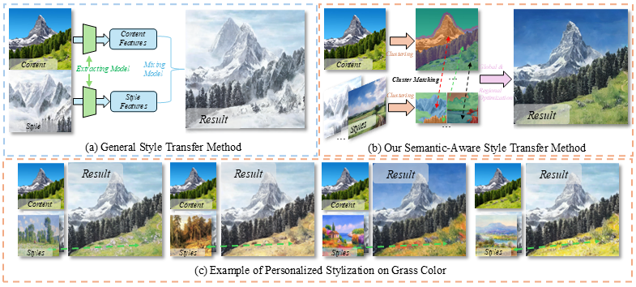

# StyleGallery: Training-free and Semantic-aware Personalized Style Transfer from Arbitrary Image References
This is the official PyTorch implementation of the following publication: 

> **"StyleGallery: Training-free and Semantic-aware Personalized Style Transfer from Arbitrary Image References".**  
> Boyu He, Yunfan Ye, Chang Liu, Wuwei Shang, Liu Fang, Zhiping Cai  
> *CVPR 2026*  
> [Project Page]() | [Paper]()

📖🚀
## 📖 Introduction
**TL;DR: StyleGallery is a training-free and semantic-aware framework to generate a high-quality stylized image from arbitrary image references.** 

  

a
